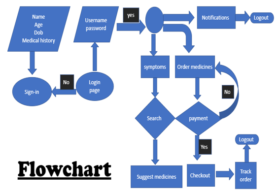

# Pharmacure
###Overview
Pharmacure is a web application that is connected to a database and whenever a user gives an input it sends a query to the database gets a required solution and gives it to the user as output. It also gives latest information about medical field to the users. Users can also buy medicines and other medical related stuff in this website. This website is compatible in all devices.

Generally, due to busy lives people often neglect to visit a doctor for minor health issues like cold, cough, fever which may lead to serious diseases in future.This problem can be effectively solved by providing virtual assistance to users which behaves exactly like a doctor. This saves time and energy for people as everything is possible by clicking in your device instead of reaching a doctor.

###Motivation
The main purpose of this project is to save time for the people. As we know every individual is busy with their works and neglect small health issues which may lead to serious problems in future. So, we came up with an idea of providing a virtual health assistance to the people through our website. This website does not contain any doctor but it can give suggestions and precautions according to your symptoms same like how a doctor suggests. This website also educates people with latest information related to medical field and diseases. And this also allows people to buy medicines.

###What does this website do?
The proposed project “Pharmacure” is mainly based on providing suggestions to the user by taking symptoms as input. Generally, it takes the symptoms and medical history (which was provided by the user during registering) as input, sends a query to the database which was linked with our website and selects an appropriate result and sends it  to the user as output. By this way it will be useful for a person to know the disease by sitting in home.
 This website also provides user with latest information related to medical field. Alert news can also be seen scrolling in each webpage of our website. Users can change in settings if they do not want alert news. But this scroll is provided by default to every user.
This website also provides an option for the users to buy medicines. Users are provided with multiple modes of payment like credit/debit and cash on delivery. Users are provided with a unique track Id when they order, using this track Id he/she can track their order until their shipment is reached.

